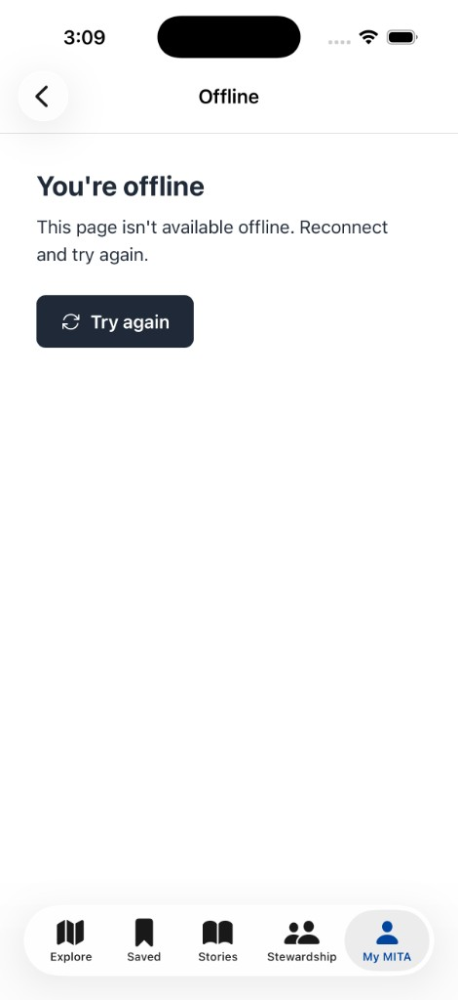

# Coldwire

[](https://rubygems.org/gems/coldwire-rails)
[](https://rubygems.org/gems/coldwire-rails)

**When your Hotwire wires go cold.**

Offline caching for Rails. Add a gem, mount it, drop a tag in your layout — pages start
working without a network. A service worker precaches what you nominate, keeps pages as
people browse, and falls back to a view [Turbo](https://turbo.hotwired.dev) will actually
render.

Works the same in a plain Hotwire app, an installed PWA, or Hotwire Native.

> **Status: early.** Extracted from a production app but young as a library. The API may
> change before 1.0.

> **Need Help**
>
> <a href="https://noreastergroup.com"></a>
>
> **Need help going offline?** Coldwire is built by [Noreaster Group](https://noreastergroup.com).
> If you want a hand adding offline to your Hotwire or Hotwire Native app,
> [talk to us](https://noreastergroup.com).

## What you get

- **[Setup in 30 seconds](docs/setup.md):** Instal gem, then `bin/rails coldwire:install`. The rest has working defaults.
- **[Cache as you go](docs/configuration.md#cache_as_you_go):** Defaults to all pages get cached as your navigate, customize to only cache certain parts of the app.
- **[Auto Sycn precaching](docs/configuration.md#auto_sync):** Define urls that can be pre-cached automatically in the background.
- **[Offline fallback page](docs/setup.md#the-offline-page):** A customizable page when a user is offline and no page is cached for that given url.
- **[Offline settings page](docs/setup.md#the-offline-settings-page):** at `/offline`: turn offline support off, force offline, sync, downloads, inspect what's cached.
- **[Easy Tailwind Variants](docs/configuration.md#tailwind-variants):** Easily show or hide content with an `online:` or `offline:` Tailwind variant.

<p align="center">
  
  
</p>

<p align="center"><em>The offline settings page that ships with it. The URL list is under Inspect cache.</em></p>

<p align="center">
  
</p>

<p align="center"><em>When a page isn't cached and there's no network, this is what people see — not a blank screen or a native error. Override it to match your app.</em></p>

## Quick start

```ruby
# Gemfile
gem "coldwire-rails"
```

```bash
bin/rails coldwire:install
```

That mounts the engine at `/offline`, writes `config/initializers/coldwire.rb`, registers
the Stimulus controller, and adds the tag to your layout. Visit `/offline` to see what's
cached.

For signed-in apps, set `cache_identity`. To have pages ready before anyone visits them,
turn on `auto_sync`. Both are in the [configuration reference](docs/configuration.md).

## Docs

- [Setup](docs/setup.md) — install, requirements, Hotwire Native on iOS
- [Configuration](docs/configuration.md) — every option and what it does
- [How it works](docs/how-it-works.md) — why a naive cache fails in Hotwire

## License

MIT. See [LICENSE](LICENSE).
