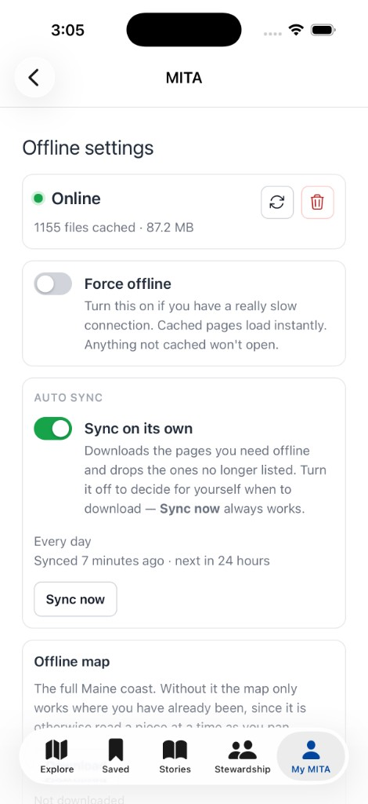
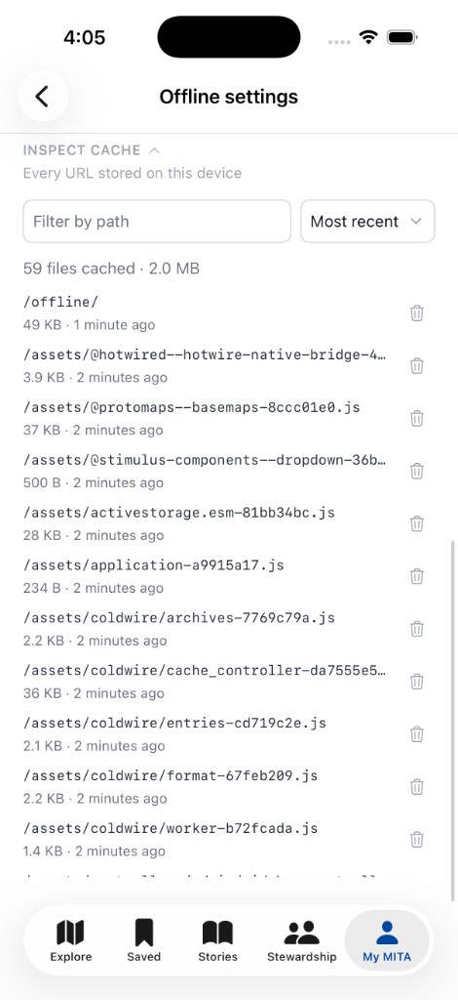

# Configuration

Everything lives in `config/initializers/coldwire.rb`. `bin/rails coldwire:install` writes
this file with every default. Only `auto_sync` really needs your attention; the rest has a
working default.

```ruby
Coldwire.configure do |config|
  config.auto_sync do |sync|
    sync.enabled = false
    sync.precache_urls = -> { [] }
    sync.interval = 6.hours
    sync.max_age = 7.days
    sync.concurrency = 4
  end

  config.cache_identity = -> {
    if respond_to?(:current_user)
      current_user&.id
    elsif defined?(Current) && Current.respond_to?(:user)
      Current.user&.id
    end
  }
  config.register_if = -> { true }
  config.caching_enabled_by_default = true
  config.offline_import = "@hotwired/turbo-rails"

  config.cache_as_you_go = [ "/*" ]
  config.never_cache = []
  config.never_intercept = [ "/up" ]

  config.cache_origins = []
  config.cache_ranges = []
  config.cache_archives = []

  config.probe_path = "/up"
  config.mark_cached_pages = true
  config.ignore_query_params = true
  config.cache_name = "coldwire"
  config.worker_scope = "/"
end
```

A bad path pattern or origin raises at boot, rather than as a 500 that quietly takes caching
down with it.

## Options at a glance

| Option | Default | What it does |
|---|---|---|
| [`auto_sync.enabled`](#autosyncenabled) | `false` | Keep the precache manifest current on an interval |
| [`auto_sync.precache_urls`](#autosyncprecache_urls) | `-> { [] }` | The pages to fetch, evaluated against your URL helpers |
| [`auto_sync.interval`](#autosyncinterval) | `6.hours` | How long to leave between syncs |
| [`auto_sync.max_age`](#autosyncmax_age) | `7.days` | Refetch a cached manifest page once it is older than this |
| [`auto_sync.concurrency`](#autosyncconcurrency) | `4` | Fetches in flight at once during a sync |
| [`garbage_collection.enabled`](#garbage_collectionenabled) | `true` | Sweep entries nothing has used in a long time |
| [`garbage_collection.max_age`](#garbage_collectionmax_age) | `30.days` | How long an entry may go untouched before it is collected |
| [`garbage_collection.interval`](#garbage_collectioninterval) | `1.day` | How long to leave between sweeps |
| [`cache_identity`](#cache_identity) | `current_user` / `Current.user` | Who the cache belongs to; changing it drops the cache |
| [`register_if`](#register_if) | `-> { true }` | Whether a page registers the worker at all |
| [`caching_enabled_by_default`](#caching_enabled_by_default) | `true` | Starting position of the Offline support switch. Not a master on/off |
| [`offline_import`](#offline_import) | `"@hotwired/turbo-rails"` | Importmap module the offline page loads to boot Turbo |
| [`cache_as_you_go`](#cache_as_you_go) | `["/*"]` | Pages stored as somebody browses. `/*` is everything |
| [`never_cache`](#never_cache) | `[]` | Never stored, by any route in. The one veto |
| [`never_intercept`](#never_intercept) | `["/up"]` | Paths the worker does not touch at all |
| [`cache_origins`](#cache_origins) | `[]` | Other origins the worker may cache |
| [`cache_ranges`](#cache_ranges) | `[]` | URLs whose `Range` requests are cached piece by piece |
| [`cache_archives`](#cache_archives) | `[]` | Large files somebody can choose to download |
| [`ignore_query_params`](#ignore_query_params) | `true` | Treat `/map` and `/map?zoom=9` as one page |
| [`probe_path`](#probe_path) | `"/up"` | Pinged to tell online from offline |
| [`mark_cached_pages`](#mark_cached_pages) | `true` | Stamp HTML served from cache |
| [`cache_name`](#cache_name) | `"coldwire"` | Cache API cache name; bump to invalidate everything |
| [`worker_scope`](#worker_scope) | `"/"` | Scope the worker registers at |

---

## `auto_sync`

Grouped because these only mean anything together: a manifest with no interval is never
fetched, an interval with no manifest has nothing to fetch.

```ruby
config.auto_sync do |sync|
  sync.enabled = true
  sync.precache_urls = -> { Site.published.map { |site| site_path(site) } }
  sync.interval = 6.hours
  sync.max_age = 7.days
  sync.concurrency = 4
end
```

There is no true background scheduling to use. WebKit ships neither Background Sync, Periodic
Background Sync, nor Background Fetch, so nothing can wake a worker in a Hotwire Native web
view. An open page works out when a sync is next owed and sleeps exactly that long; the work
then runs in the worker, independently of the page that started it.

A sync outlives the page that started it, but not necessarily the browser's patience. The
clock is restarted only when the worker reports a full pass. Resuming needs no bookmark —
each pass recomputes what is missing from what is actually in the cache.

Each pass:

| | |
|---|---|
| **Fetches what is missing** | a newly published record with no cached copy |
| **Refetches what is old** | a cached copy older than `max_age` |
| **Skips what is fine** | anything younger than `max_age` costs nothing |
| **Retires what left the manifest** | an unpublished record is dropped from the cache |

Retiring only touches entries the manifest owns. Assets, and pages cached by visiting them,
are never retired.

The offline settings page has a per-device switch that turns automatic syncing off, remembered in
`localStorage`. Switched off, no page holds a sync timer; **Sync now** still runs a pass.

<p align="center">
  
  
</p>

### `auto_sync.enabled`

**Default:** `false`

Off unless asked for. Background fetching is a decision about somebody's data plan. Until
this is `true`, `precache_urls` is never fetched on its own — **Sync now** on the offline
settings page still runs a pass if you want one by hand.

### `auto_sync.precache_urls`

**Default:** `-> { [] }`

The pages to keep cached. Evaluated against your app's URL helpers, so `article_path` means
your route rather than one of Coldwire's. Give it an argument and it receives the controller:

```ruby
sync.precache_urls = -> { Article.published.map { |a| article_path(a) } }

sync.precache_urls = ->(controller) {
  controller.current_user.articles.map { |a| article_path(a) }
}
```

Listing a URL here is an explicit instruction: `cache_as_you_go` does not filter it.
`never_cache` still wins.

A stored page's stylesheets, scripts, and images are fetched with it, whatever the lists say.

### `auto_sync.interval`

**Default:** `6.hours`

How long to leave between syncs. An ActiveSupport duration works; the worker receives
seconds. Leave this long — a sync is a burst of fetches, not something to run on every
visit.

The interval is also written as a `<meta>` on every page, so a document that outlives a
config change follows the new value rather than the one it was born with.

### `auto_sync.max_age`

**Default:** `7.days`

Refetch a manifest page once its cached copy is older than this. `nil` fetches only what is
missing, so pages already cached are never noticed to have changed.

### `auto_sync.concurrency`

**Default:** `4`

Fetches in flight at once during a sync. Sequential would take a round trip per URL; all at
once would stall the app's own requests behind hundreds of connections.

---

## `garbage_collection`

A cache that fills as people browse fills forever. Collection takes back what nothing has
asked for in a long time.

```ruby
config.garbage_collection do |gc|
  gc.enabled = true
  gc.max_age = 30.days
  gc.interval = 1.day
end
```

**Only ever with a connection.** Deleting is the one cache operation with no way back:
whatever goes is gone until the network can be reached again. So a sweep pings
[`probe_path`](#probe_path) first and stands down if it cannot be reached, and stands down
under force offline. `navigator.onLine` is not consulted — a web view answers it wrongly often
enough to be worthless for a decision this expensive to get wrong.

**Untouched, not old.** Age is measured from when an entry was last *used*, not when it was
first fetched. Storing a page renews everything it names, so the stylesheet every page in your
app loads keeps a fresh date even though nothing ever refetches it. Without that, an asset
would carry the date of the very first page that pulled it in and be collected while the whole
app was still using it.

Renewal rewrites from the cache — it is never a network request — and only once an entry has
aged past a quarter of `max_age`. Under that it costs a lookup, so an ordinary navigation is
not rewriting every asset the page names.

Two things are never collected, whatever their age:

| | |
|---|---|
| **What the offline page needs** | browsing never touches it, and it is wanted precisely when there is no network |
| **Downloaded archives** | somebody chose to spend a data plan on those; disuse does not make them safe to throw away |

A sweep is paced by an open page the same way a sync is, for the same reason: nothing can wake
a worker in a WebKit web view. It is not recorded unless it actually ran, so a device that has
been offline for a week sweeps on its next page load with a connection.

### `garbage_collection.enabled`

```ruby
config.garbage_collection { |gc| gc.enabled = false }
```

On by default, unlike [`auto_sync`](#auto_sync). Syncing spends somebody's data plan, which is
theirs to opt into; a sweep spends nothing and the alternative is a cache that grows on their
phone until the browser evicts the whole thing. Off, nothing is collected and nothing is
renewed.

### `garbage_collection.max_age`

```ruby
config.garbage_collection { |gc| gc.max_age = 60.days }
```

How long an entry may go untouched before a sweep takes it. `nil` collects nothing, which is
the same as `enabled = false`.

Keep it comfortably longer than [`auto_sync.max_age`](#autosyncmax_age). A manifest page is
refetched once its copy is older than that, so as long as collection outlives refetching, a
sync brings a page back up to date well before a sweep would consider it. The defaults leave
30 days against 7.

### `garbage_collection.interval`

```ruby
config.garbage_collection { |gc| gc.interval = 12.hours }
```

How long to leave between sweeps. A sweep reads the cache index and deletes; there is nothing
to pace against a network, so this is about not doing pointless work on every page load rather
than about cost.

---

## `cache_identity`

**Default:** `current_user&.id` or `Current.user&.id` when either is in scope

Who the cache belongs to, usually the signed-in user's id. Evaluated in the view, so
`current_user` is in scope — and `Current.user` if you keep the user there instead.
Recorded in `localStorage`; when it changes between page loads the cache is dropped —
which is what makes signing out, and switching accounts, safe.

```ruby
config.cache_identity = -> {
  if respond_to?(:current_user)
    current_user&.id
  elsif defined?(Current) && Current.respond_to?(:user)
    Current.user&.id
  end
}
```

That is what the installer writes. If neither helper exists, the identity is empty and the
cache persists across sessions — fine for a single-user or fully public app. Override it
if your signed-in user lives somewhere else.

A few edges the setting already handles:

- No stored identity is not a change of identity — it is a browser that has not been told
  yet. Treating empty `localStorage` as "somebody else" would destroy a good cache the first
  time storage came back empty.
- The cache is not discarded while offline. There would be nothing to refill from. The
  mismatch waits until there is a connection.

Cached pages contain whatever the session that fetched them could see. Setting this does not
encrypt them; it only drops them when the owner changes.

---

## `register_if`

**Default:** `-> { true }`

Whether a page registers the worker at all — and so whether it caches or syncs anything.
Evaluated in the view, so `request` and `current_user` are both in scope. A block that
declares a parameter is handed the request:

```ruby
config.register_if = -> { true }

config.register_if = -> {
  request.user_agent.to_s.include?("Hotwire Native") && current_user.present?
}

config.register_if = ->(request) { request.format.html? }
```

A page that does not register does not cache or sync. The helper
`coldwire_service_worker_tag` already consults this, so you can leave the tag in the layout
and gate registration here.

---

## `caching_enabled_by_default`

**Default:** `true`

Starting position of the Offline support switch on the offline settings page. It does not
turn offline support on or off for the app — people do that themselves, and their choice is
remembered on the device. A fresh device follows this.

```ruby
config.caching_enabled_by_default = true
```

This is not [`register_if`](#register_if). `register_if` is the app's decision that the
worker should not run here at all. This is only where the switch starts.

---

## `offline_import`

**Default:** `"@hotwired/turbo-rails"`

The importmap module the offline page loads to boot Turbo. Hotwire Native reports "Turbo is
not present" for any page where `window.Turbo` never appears, so the fallback has to boot
Turbo — and Turbo alone, since one uncached module would fail the whole graph.

Set this to `nil` if you are not on importmap-rails, and load Turbo yourself in the offline
template instead. Override the template at
`app/views/coldwire/service_worker/offline_page.html.erb`.

---

## `cache_as_you_go`

**Default:** `["/*"]` (everything you browse)

What browsing stores. These are the pages worth keeping as somebody moves through the app.
What a stored page needs in order to render — its stylesheets, its scripts, its images — is
stored with it, whether or not those match anything in the list.

```ruby
config.cache_as_you_go = [ "/sites", "/sites/:id", "/sites/:id/card" ]
```

`/*` is every path, including `/`. Narrow it to the pages worth keeping, or set `[]` to
store nothing by browsing. `never_cache` still wins either way.

It does not apply to the precache manifest: listing a URL in `precache_urls` is an explicit
instruction, and quietly declining it would mean precaching 84 pages and silently getting 60.

See [Pattern syntax](#pattern-syntax) for how strings and Regexps match.

---

## `never_cache`

**Default:** `[]`

Never stored, by any route in: not by browsing, not as a subresource of a page that
references it, not by the precache manifest. The one veto.

```ruby
config.never_cache = [ "/users/:id/edit", %r{^/admin(/|$)} ]
```

**`never_cache` always wins**, the manifest included. Between two explicit instructions that
contradict each other, the one that says do not store is the safe one to honour — it is
where auth pages and admin go.

This is not [`never_intercept`](#never_intercept). `never_cache` means *intercept but never
store automatically*, so the request still reaches your offline view. Put auth paths here.

See [Pattern syntax](#pattern-syntax).

---

## `never_intercept`

**Default:** `["/up"]` (`probe_path` is added for you)

Paths the worker does not touch at all, matched as prefixes. Coldwire's own worker script
and manifest are added for you. The request goes straight to the network and so fails
outright offline, showing the SDK's error screen rather than your offline page — which is
what you want for a health check, and almost never what you want for a page.

```ruby
config.never_intercept = [ "/up", "/health" ]
```

Unlike `cache_as_you_go` and `never_cache`, these are **prefix strings**, not route
patterns. `/up` matches `/up` and `/up/ready`. Regexps are not accepted here.

Compare:

| Setting | Worker | Offline |
|---|---|---|
| `never_intercept` | stands aside | the request goes to a dead network |
| `never_cache` | still answers | your offline page can still render |

So auth pages, admin, anything sensitive: `never_cache`. A probe the worker must never be
able to answer from a cache: `never_intercept`.

---

## Pattern syntax

`cache_as_you_go`, `never_cache`, and `cache_ranges` take the same shapes: route-pattern
strings, or Regexps.

A **string** is a route pattern, and matches that shape and nothing else:

| Pattern | Matches | Does not match |
|---|---|---|
| `/sites` | `/sites` | `/sites/1`, `/sites/search` |
| `/sites/:id` | `/sites/1` | `/sites`, `/sites/1/card` |
| `/sites/:id/card` | `/sites/1/card` | `/sites/1/notices` |
| `/sites/*` | `/sites/1`, `/sites/1/card` | `/sites` |
| `/*` | `/`, `/sites`, `/sites/1/card` | — |

`:name` is exactly one segment; `*` takes everything remaining and may only be last. A
lone `/*` is the exception: it is every path, including `/`. `/sites/*` still does not
match `/sites`.

Coldwire raises at boot on anything else — a missing leading slash, `*` in the middle, a
malformed segment — because every mistake of this shape fails the same silent way: the rule
never matches, and you find out when a page you expected offline is not there.

Prefer the explicit shapes over `*`. A prefix reads as "this section of the app" but takes
everything underneath with it, and with `ignore_query_params` on a single `/sites/search`
entry ends up answering every search.

A trailing slash is trimmed, so `/sites/` and `/sites` behave alike. `/` itself is left
alone — chomping that would leave an empty string and the rule would vanish.

A **Regexp** is tested against the path by JavaScript's `RegExp`, so write JS syntax — `^`
and `$`, not `\A` and `\z`. The `i` flag is honoured; Coldwire raises on `\A`/`\z`/`\Z` and
the `x`/`m` flags rather than letting a rule silently never match.

```ruby
config.never_cache = [ %r{^/admin(/|$)}, %r{^/users/[^/]+/edit$} ]
```

---

## `cache_origins`

**Default:** `[]`

Origins besides your own that the worker may cache. Each has to send CORS headers naming
your app, or the response arrives opaque — status 0, no headers, no readable body — and
there is nothing worth storing. Ranged sources must also expose `Content-Range`.

```ruby
config.cache_origins = [ "https://tiles.example.com" ]
```

Bare origins only: a scheme and a host, no path, no trailing slash. Anything else raises at
boot, because a malformed origin silently fails to match a request's origin.

Cross-origin requests are passed through unless the origin is listed here.

---

## `cache_ranges`

**Default:** `[]`

URLs whose `Range` requests are cached piece by piece, keyed by the range. The Cache API
refuses a `206`, so without this, tiles and media are uncacheable. Same [pattern
syntax](#pattern-syntax) as the lists above.

```ruby
config.cache_ranges = [ "/tiles/*", %r{\.pmtiles$} ]
```

Patterns match the URL path, same as the other lists — not the full URL. A cross-origin
tile at `https://tiles.example.com/basemap.pmtiles` is allowed only when that origin is in
[`cache_origins`](#cache_origins) *and* its path matches a rule here.

This pairs with [`cache_archives`](#cache_archives): `cache_ranges` caches the slices
actually read, so the places you have already opened work offline, and downloading the
archive is how the rest does.

---

## `cache_archives`

**Default:** `[]`

Large files somebody can choose to keep — a tile archive, an audio guide, a reference PDF.
Nothing downloads on its own: hundreds of megabytes over somebody's connection is their
decision. The offline settings page shows **Download**, then **Download again** and **Delete** once it
is on the device, or **Resume** where a download stopped part way.

```ruby
config.cache_archives = [
  { url: "https://tiles.example.com/basemap.pmtiles",
    title: "Offline map",
    description: "The whole coast, rather than only the places you have opened." }
]
```

A bare URL string works too, and the filename becomes the title. Each URL must be absolute.

Files arrive in 8 MB chunks, which is what makes a dropped connection cost seconds instead
of the whole download. A `Range` request against a downloaded archive is answered by
slicing the chunks.

If the file lives on another origin, list that origin in [`cache_origins`](#cache_origins).

---

## `ignore_query_params`

**Default:** `true`

Treat `/map` and `/map?lat=44.1&zoom=9` as one cached page. The query is dropped both when
matching and in the key an entry is stored under. Matching alone would still let a map that
rewrites `lat`/`lng`/`zoom` on every pan write hundreds of near-duplicate entries.

This is blunt, deliberately. It also collapses query strings that genuinely select content:
`/search?q=otters` and `/search?q=puffins` become one entry. Set it to `false` if your app
caches pages whose content depends on the query.

```ruby
config.ignore_query_params = false
```

---

## `probe_path`

**Default:** `"/up"`

What the offline settings page pings to tell online from offline, because `navigator.onLine` only
reports whether an interface is up. Added to `never_intercept` for you — a probe answered
from the cache would resolve with the network down, which is precisely backwards.

```ruby
config.probe_path = "/up"
```

Point it at whatever health check your app already has. The path must not require
authentication the worker cannot satisfy.

---

## `mark_cached_pages`

**Default:** `true`

Stamp HTML the worker serves from cache *because the network was unavailable* before it
reaches the page:

```html
<html data-coldwire-offline data-coldwire-cached-at="1756400000">
```

Two markers, because they are read at different moments: the `<html>` attributes are there
for the first paint of a cold boot, before any JS runs, and a `<meta name="coldwire-offline">`
for Turbo visits, since Turbo merges the head but never copies `<html>` attributes.
`coldwire_service_worker_tag` mirrors the meta onto `<html>` on each `turbo:load`.

Any CSS can key off the attribute.

### Tailwind variants

With Tailwind v4, two custom variants give you `offline:` and `online:`:

```css
@custom-variant offline (html[data-coldwire-offline] &);
@custom-variant online (html:not([data-coldwire-offline]) &);
```

Then show or hide content from the markup:

```html
<p class="offline:hidden">You're online.</p>
<p class="online:hidden">You're looking at a cached page.</p>
```

From JavaScript, `window.Coldwire`:

```js
Coldwire.isOffline()        // this page did not come from the network
Coldwire.isForcedOffline()  // …because the switch is on, rather than for want of a signal
Coldwire.isCachingEnabled() // the Offline support switch, not navigator.serviceWorker
Coldwire.cachedAt()         // a Date, or null if it came from the network
Coldwire.onChange((state) => { … })  // fires on every Turbo visit and on toggling force
                                     // offline; returns its own unsubscribe
```

`isOffline()` reads the marker rather than `navigator.onLine`, which a web view reports
unreliably in both directions. `onChange` is what lets a map put its remote sources back
without a reload.

Set this to `false` if you do not want the stamp. The worker still serves from cache; the
page just cannot tell.

---

## `cache_name`

**Default:** `"coldwire"`

Name of the Cache API cache. Bump it to invalidate every entry at once — after a deploy
that changes HTML structure enough that old copies would mis-render, for example.

```ruby
config.cache_name = "coldwire-v2"
```

This is a blunt instrument. `auto_sync.max_age` is how individual manifest pages go stale;
`cache_identity` is how a user change drops the cache. Bumping the name drops everything
for everyone, assets included.

---

## `worker_scope`

**Default:** `"/"`

Scope the worker claims. The worker is served from the engine mount point, so the response
also sends `Service-Worker-Allowed` to widen it past that directory — otherwise a mount at
`/offline` would only control `/offline/*`.

```ruby
config.worker_scope = "/"
```

Leave this at `/` unless you have a reason to let the worker see only part of the origin.
A narrower scope means pages outside it are neither cached nor served offline.
